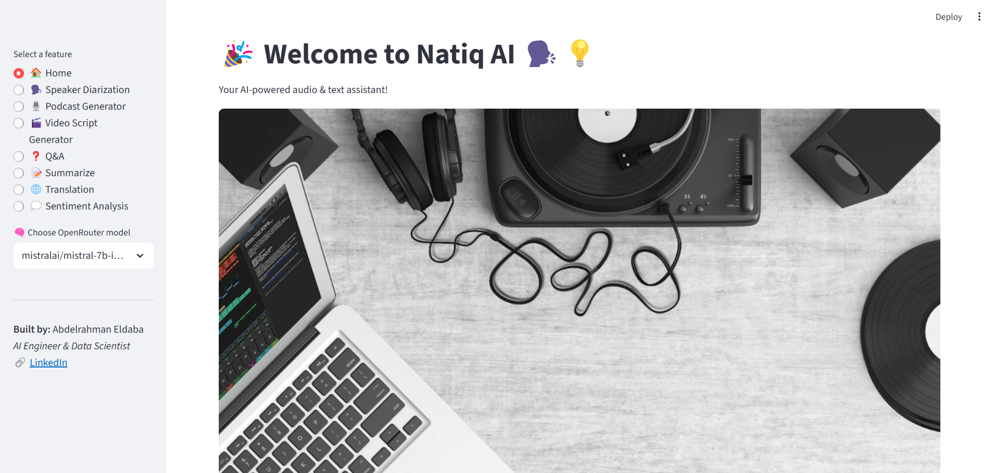
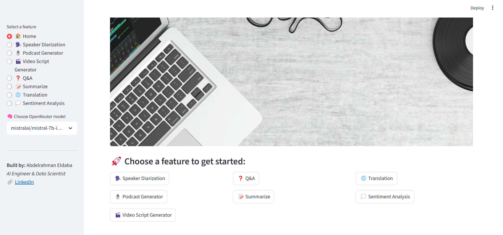
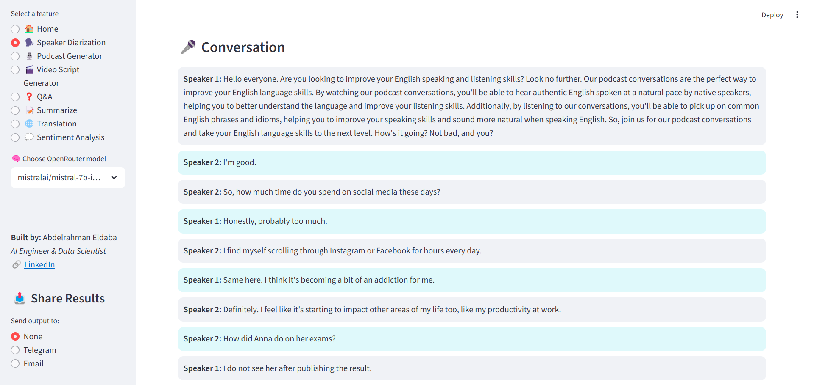
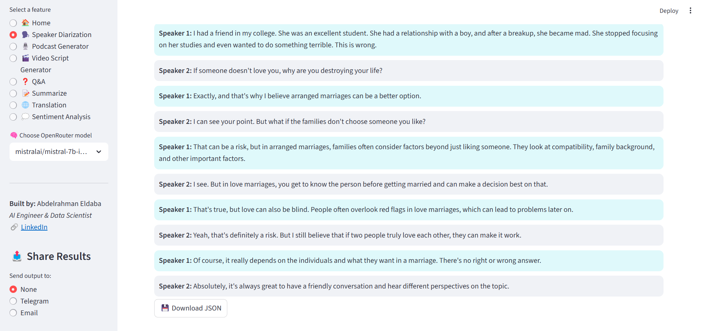
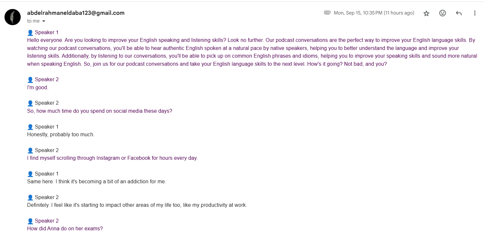
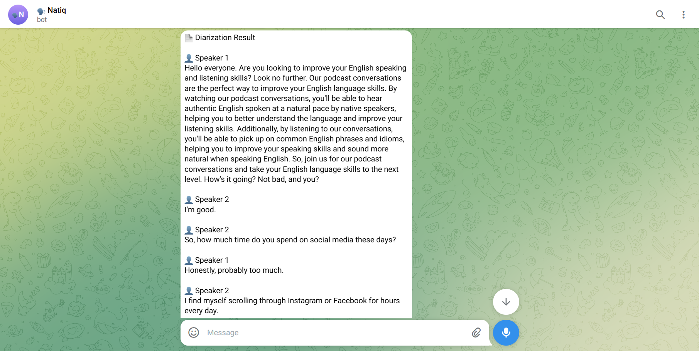
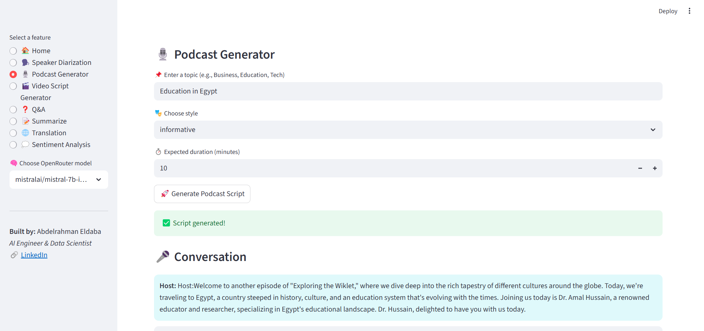
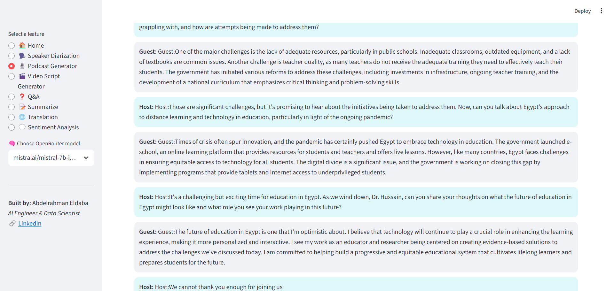
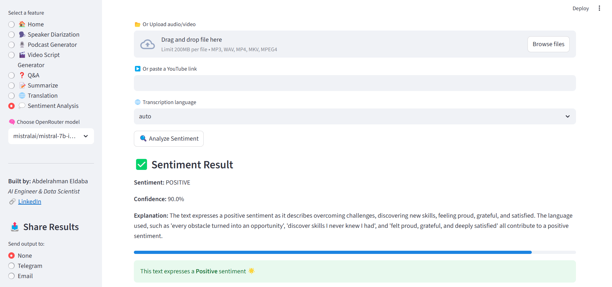

# 🎙️ Natiq AI

Natiq AI is an intelligent video & audio assistant powered by advanced **AI models**.  
It helps you **analyze, transcribe, summarize, translate, and generate insights** from video and audio data, all within an interactive interface.

---
---

## ✨ Features
- **Speaker Diarization** → Identify and separate multiple speakers in a conversation.  
- **Podcast Generator** → Generate podcast scripts and manage episodes.  
- **Q&A Assistant** → Ask questions about your transcripts or audio files.  
- **Summarizer** → Create concise summaries of long discussions.  
- **Sentiment Analysis** → Detect tone and emotions in conversations.  
- **Translation** → Translate audio transcripts into multiple languages.  
- **Video Script Generator** → Convert transcripts into ready-to-use scripts for video content.  
- **Notifications** → Send results via **Telegram** and **Email**.  

---
---

## 📸 App Demo Images



---



---


---



---



---



---



---



---



---



---
---

## 🗂️ Project Structure
```
NATIQ_AI/
│── assets/                    # Static assets
│── models/                    # Pre-trained from Hugging Face
│── modules/                   # Core Python modules (chunker, notifier, etc.)
│   ├── chunker.py
│   ├── diarization.py
│   ├── downloader.py
│   ├── notifier.py
│   ├── podcast_generator.py
│   ├── qa.py
│   ├── sentiment.py
│   ├── summarizer.py
│   ├── transcriber.py
│   ├── translator.py
│   └── video_script_generator.py
│── outputs/                   # Generated outputs
│── temp/                      # Temporary files
│── ui/                        # Streamlit UIs for each feature
│   ├── diarization_ui.py
│   ├── podcast_generator_ui.py
│   ├── qa_ui.py
│   ├── sentiment_ui.py
│   ├── summarizer_ui.py
│   ├── translation_ui.py
│   └── video_script_generator_ui.py
│── app.py                     # Main Streamlit entry point
│── requirements.txt           # Python dependencies
│── .env.example              # Example environment variables
│── .gitignore
└── README.md
```

---
---

## ⚙️ Installation

1. **Clone the repo**
   ```bash
   git clone https://github.com/Abdelrahman47-code/Natiq_AI
   cd Natiq_AI
   ```

2. **Create virtual environment**
   ```bash
   python -m venv venv
   source venv/bin/activate   # Mac/Linux
   venv\Scripts\activate      # Windows
   ```

3. **Install dependencies**
   ```bash
   pip install -r requirements.txt
   ```

4. **Set up environment variables**
   Copy `.env.example` → `.env` and update with your keys:
   ```ini
   # OpenRouter
   OPENROUTER_API_KEY=your_api_key_here

   # Telegram
   TELEGRAM_BOT_TOKEN=your_telegram_bot_token
   TELEGRAM_CHAT_ID=your_chat_id

   # Email
   EMAIL_USER=your_email@gmail.com
   EMAIL_PASS=your_password
   SMTP_SERVER=smtp.gmail.com
   SMTP_PORT=587
   ```

---
---

## 🚀 Usage
1. **Run the Streamlit app**:
   ```bash
   streamlit run app.py
   ```

2. **Select a module from the sidebar**:
   - **Diarization** → Upload audio & identify speakers
   - **Q&A** → Ask questions about transcripts
   - **Summarizer** → Generate concise summaries
   - **Translation** → Translate text/audio
   - **Podcast Generator** → Generate podcast scripts
   - **Notifications** → Share results via Telegram or Email

---
---

## 📦 Requirements
All dependencies are listed in `requirements.txt`.

---
---

## 📬 Notifications
- **Telegram**: Get AI outputs instantly in your Telegram chat.
- **Email**: Receive full transcripts, summaries, or Q&A results directly via email.

---
---

## 🤝 Contributing
Contributions are welcome!
1. Fork the repo
2. Create a feature branch (`git checkout -b feature-name`)
3. Commit changes (`git commit -m "Add feature"`)
4. Push (`git push origin feature-name`)
5. Open a Pull Request

---
---

## 📜 License
This project is licensed under the MIT License.

---
---

## 🙌 Acknowledgements
- **OpenRouter** for LLM APIs
- **Streamlit** for the UI
- **PyTorch / HuggingFace** for models

---
---

## 🎥 Explanation Video on LinkedIn
👉 [Watch it here](https://www.linkedin.com/your-video-link)

---
---
## 👨‍💻 Made by: Abdelrahman Eldaba

- Check out my website with a portfolio [Here](https://sites.google.com/view/abdelrahman-eldaba110) 🌟
- Connect with me on [LinkedIn](https://www.linkedin.com/in/abdelrahmaneldaba) 🌐
- Look at my [Kaggle](https://www.kaggle.com/abdelrahmanahmed110)🚀